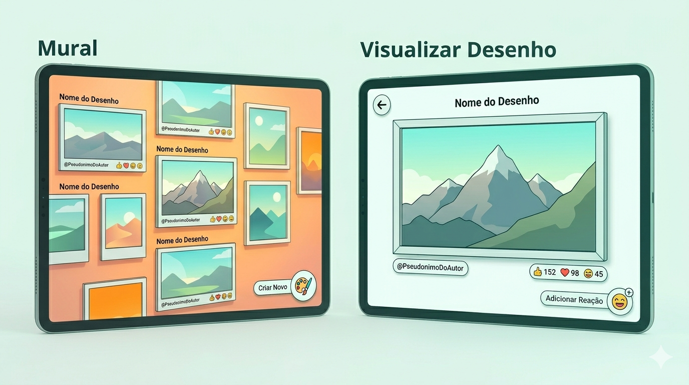

# 🎨 Mural de Artes Digitais
> **Hospital Amaral Carvalho (HAC)**
>
> Um espaço seguro, lúdico e colaborativo de expressão para crianças em tratamento oncológico.

---

## 📋 1. Contexto e Visão Geral

Crianças em tratamento oncológico no **Hospital Amaral Carvalho (HAC)** frequentemente enfrentam longos períodos de isolamento e desafios emocionais. 

Este projeto visa criar uma **janela mágica**: uma aplicação digital projetada para animar e estimular esses pacientes, oferecendo um ambiente seguro onde podem expressar sua criatividade e se conectar com outros através da arte.

## 🚀 2. Definição do Produto

O **Mural de Artes Digitais** é um sistema **Web/PWA** focado no compartilhamento social de desenhos.

*   **Objetivo:** Criar um ambiente acolhedor e social.
*   **Dinâmica:** As crianças criam artes digitais e as "penduram" em um mural virtual 3D infinito.
*   **Acesso:** Otimizado para dispositivos móveis, tablets e computadores, com foco em baixíssima fricção.

---

## 🛠️ 3. Arquitetura e Stack Tecnológica

A aplicação é projetada para ser leve, performática e visualmente impactante.

| Camada | Tecnologia | Propósito |
| :--- | :--- | :--- |
| **Frontend UI** | `React.js` + `Vite` | Interface de usuário e gerenciamento de estado. |
| **Engine 3D** | `Three.js` + `R3F` | Visualização imersiva do mural e transições de câmera. |
| **Engine 2D** | `Atrament.js` | Ferramenta de desenho (pincéis, formas, preenchimento). |
| **Banco Local** | `Dexie.js` | Cache local (IndexedDB) para persistência e performance. |
| **Banco de Dados** | `Supabase PostgreSQL` | Armazenamento de metadados, coordenadas, reações e hospedagem das imagens das artes (WebP). |
| **Backend** | `Supabase Edge Functions` | Lógica server-side, middleware de IA e operações. |
| **Hospedagem** | `Vercel` | Deploy da aplicação PWA para alta disponibilidade |

---

## ✨ 4. Requisitos Funcionais

### 🖼️ 4.1. O Mural Infinito Colaborativo
*   **Mural Virtual:** Espaço 3D onde os desenhos são exibidos como quadros.
*   **Navegação Livre:** Movimentação fluida via *Pan* (toque e arraste), travada nos eixos X e Y.
*   **Expansão Inteligente:** O mural cresce conforme a necessidade, mantendo a área de navegação contida se houver poucos desenhos.
*   **Prevenção de Sobreposição:** Lógica automática para garantir que um desenho não cubra outro.
*   **Atualização em Tempo Real:** Sincronização via Supabase Realtime para que novas artes apareçam instantaneamente para todos os usuários.
*   **Carregamento Dinâmico:** Os componentes 3D são renderizados sob demanda conforme a câmera se aproxima das coordenadas, otimizando o uso de memória.
*   **Botão de Ação Flutuante (FAB):** Um botão circular 2D no canto inferior direito com ícone de paleta e pincel ("Criar Novo").
*   **Música Ambiente:** Música ambiente suave e calma para acompanhar a navegação no mural e interação com a aplicação.

### 🔍 4.2. Visualização de Desenho
Ao selecionar uma arte, ocorre um **zoom in suave** Foco no Desenho completo e Centralizado na Tela com informações sobre o desenho
*   **Layout:**
    *   **Navegação:** Ícone 2D de "Seta de Voltar" no canto superior esquerdo.
    *   **Metadados:** Nome do desenho centralizado acima da moldura; Pseudônimo abaixo da moldura à esquerda.
    *   **Interação:** Contador de reações (estilo WhatsApp) abaixo da moldura à direita; Botão "Adicionar Reação" (ícone emoji com "+") no canto inferior direito da tela.
*   **Imersão:** Foco exclusivo na arte selecionada, que ocupa a maior parte da tela em uma moldura minimalista.

### 🖌️ 4.3. Interface de Criação
Uma interface minimalista e intuitiva, focada no essencial:
*   **Ferramentas:** Pincel (ajustável), Borracha (ajustável), Balde de Tinta, Formas Básicas (Retângulo, Círculo e Linha) e Conta-gotas.
*   **Controles:** Zoom nativo (pinch-to-zoom), Desfazer, Refazer e paleta de cores harmoniosa baseada em tons modernos (estilo Tailwind CSS).
*   **Resiliência:** Salvamento automático no `IndexedDB` (Por meio do Dexie.js) para evitar perda de progresso em caso de fechamento acidental.

### ❤️ 4.4. Sistema de Reações Sociais
*   **Estilo WhatsApp:** Seleção rápida de emojis.
*   **Reações disponiveis:** 🔥 🌟 😍 🤣 😎 😮 👍 👑 🤯 🏆 🎉 🎨 🎬
*   **Limite de Reação:** Cada usuário de sessão pode reagir apenas uma vez por desenho.

---

## 🛡️ 5. Regras de Negócio e Segurança

> **Responsividade:** O sistema deve ser responsivo para diferentes tamanhos de tela. O ideal é que funcione bem em tablets e computadores.

> [!IMPORTANT]
> **Imutabilidade:** Uma vez publicado, o desenho não pode ser editado ou removido pelo autor, garantindo a integridade do mural histórico.

> [!TIP]
> **Fricção Zero:** Não existe sistema de login. O usuário define um **Pseudônimo** ao entrar, que é armazenado em sessão e atribuído automaticamente às suas artes.

> [!NOTE]
> **Gestão de Sessão:** O usuário de sessão é temporário e destruído ao fechar o site, exceto se houver um desenho em progresso. Não há armazenamento desses usuários no banco de dados.

> [!NOTE]
> **Filtro Regional:** O sistema utiliza geolocalização aproximada (via IP) para priorizar a exibição de artes da mesma região (ex: Jaú/SP), criando um senso de comunidade local.

### 🛡️ 5.1. Segurança e Moderação (IA)
*   **Middleware de Validação:** Toda imagem enviada passa por um middleware (Supabase Edge Functions) que utiliza IA (Transformers.js) para detectar conteúdo sensível.
*   **Filtro Silencioso:** Se detectado conteúdo impróprio, a arte **não** é salva no Supabase. Ela permanece apenas no navegador do autor (via Dexie.js), simulando sucesso na postagem, mas ficando invisível para os demais usuários. O desenho local é deletado ao fim da sessão.

---

## 🎨 6. Estética e Design (UI/UX)

### 6.1. Linguagem Visual e Estética
*   **Estilo "Toon Clean Shading":** Renderização 3D com visual de desenho animado moderno. Inclui contornos (outlines) definidos ao redor de elementos 3D, sombras minimalistas e cores ultra-vibrantes.
*   **Iluminação e Sombras:** Luz suave e direcional com sombreamento *toon* (cel shading) marcado para reforçar o aspecto de cartoon digital polido.
*   **Cores:** Paleta viva, alegre e harmoniosa. O fundo do mural possui um tom alaranjado suave para não competir com as artes.
*   **Interface Híbrida (3D/2D):** 
    *   **Cena 3D:** O mural e os quadros são elementos tridimensionais com profundidade.
    *   **UI 2D:** Todos os botões, ícones e containers de texto são elementos gráficos planos (flat) sobrepondo a cena 3D.

### 📐 6.2. Composição dos Quadros (Mural)
*   **Proporção:** Todos os quadros seguem a proporção **16:9**, com o desenho ocupando todo o interior.
*   **Metadados (Texto permitido):**
    *   **Superior:** "Nome do Desenho" em fonte semi-negrito acima da moldura (canto esquerdo).
    *   **Inferior:** "@PseudonimoDoAutor" em fonte regular abaixo da moldura (canto esquerdo).
*   **Engajamento:** Ícones circulares 2D de reações (emojis) organizados abaixo da moldura (canto direito), ao lado das reações tem um contador de quantas vezes foi adicionada a reação.

### Exemplo Visual do Projeto

> **Nota de Design:** O estilo deve ser mais vibrante e com o traço de cartoon (outlines) mais evidente do que no exemplo acima.
---

## 📊 7. Modelagem de Dados (Supabase PostgreSQL)

**Tabela:** `mural_artes`

```json
{
  "id": "identificador_unico",
  "autor": "Nome da Criança",
  "imagem_url": "url_do_firebase_storage",
  "coordenadas": {
    "x": 100,
    "y": 250
  },
  "tamanho": {
    "width": 300,
    "height": 200
  },
  "reacoes": {
    "feliz": 12,
    "estrela": 5,
    "coracao": 2
  },
  "regiao": "SP-Jau",
  "criado_em": "timestamp"
}
```

> [!CAUTION]
> **Otimização de Imagem:** Todas as artes devem ser convertidas para o formato **WebP** antes do upload para garantir performance e economia de dados.

---

## 💾 8. Estratégia de Cache e Persistência (Dexie.js)

Para maximizar a performance e reduzir custos com Supabase:
*   **Sincronização Híbrida:** Ao iniciar, a aplicação baixa um lote inicial do Supabase e o armazena no **Dexie.js (IndexedDB)**, caso ainda não esteja no banco local.
*   **Busca por Proximidade:** A busca de quais quadros exibir é feita diretamente no banco local, comparando a posição da câmera do R3F com as coordenadas X/Y armazenadas no Dexie.
*   **Redução de Overload:** O navegador gerencia apenas os componentes 3D visíveis ou próximos, consultando o banco local em vez de fazer requisições constantes à rede.